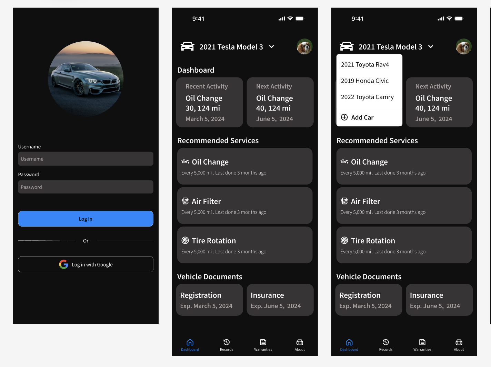
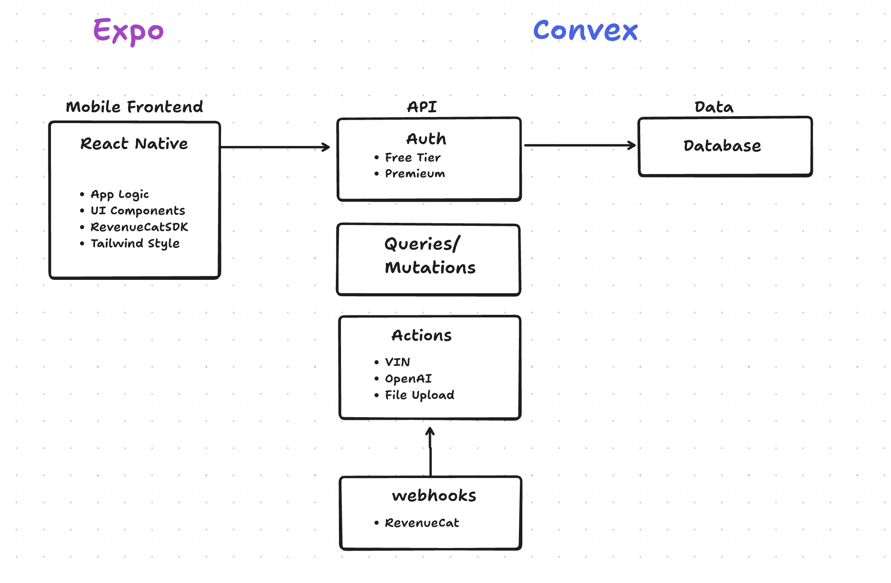
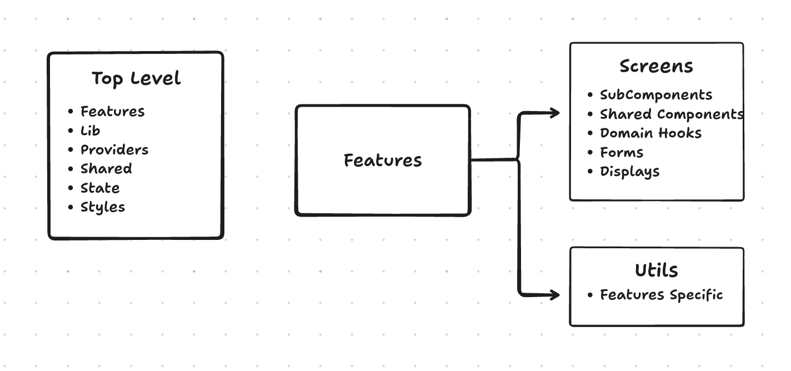
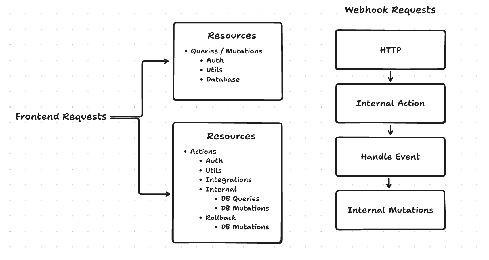

# 🏎️ Nexus Auto

A mobile-first solution built with **React Native** and **Convex** for car owners who want to avoid overpaying for maintenance. This app empowers users to cross-reference technician advice with manufacturer data, track digital receipts, and maintain a verifiable service history for resale value.

---

## 🎯 The Problem (User Avatar)
The average driver is not a mechanic. They often face "information asymmetry" at the repair shop, leading to anxiety about overpaying for unnecessary services. 

**Our target user:**
* Doesn't know much about cars and fears being overcharged.
* Wants to cross-reference technician advice with manufacturer data.
* Needs to keep a log of repairs, warranties, and costs to use across different shops.
* Wants a verifiable record of maintenance history to maximize resale value.

---

## 📋 User Stories

### 🔐 Authentication
* **Sign Up:** As a new user, I want to create an account via email or Google to securely manage my vehicle data.

### 🚗 Car Management
* **Onboarding:** As an owner, I want to add a car via license plate, make, model, and year to track specific maintenance needs.
* **Mileage Tracking:** As an owner, I want to update my mileage so the app can provide accurate, interval-based reminders.
* **Vehicle Control:** As an owner, I want to edit or remove vehicles to keep my dashboard current.

### 🛠️ Maintenance & Logging
* **Smart Reminders:** As an owner, I want alerts for routine maintenance (oil, tires) based on mileage or time.
* **Service Records:** As an owner, I want to manually log service details to maintain a complete history.
* **Digital Receipts:** As an owner, I want to upload photos of receipts to keep proof of work and expenses.
* **Auto-Parsing:** As an owner, I want the app to extract date and cost from receipt photos to save time.

### 🛡️ Warranty & Dashboard
* **Warranty Tracking:** As an owner, I want to log and view part warranties to check coverage before paying for new repairs.
* **Central Dashboard:** As a user, I want a single view of all cars and upcoming tasks to stay organized.

---

## 🎨 Design & User Experience

The interface for **Nexus Auto** utilizes a premium "Dark Mode" aesthetic, drawing inspiration from modern automotive interfaces like the Tesla mobile app to provide a high-contrast, utility-first experience.



### Design Principles:

* **High-Contrast Utility:** Deep charcoal backgrounds paired with vibrant blue action buttons ensure the app is readable in high-glare environments like garages or service centers.
* **Information Hierarchy:** Critical vehicle health data and "Recommended Services" are placed front-and-center to eliminate information overload for non-technical users.
* **Garage-Ready Interface:** Large touch targets and a streamlined navigation bar allow for easy one-handed operation while managing vehicle tasks.
* **Visual Clarity:** Status indicators use a strict color language (Green/Red/Amber) to communicate vehicle urgency at a glance.

### 🔗 Design Assets

* **Figma File:** [View Design Mockups](https://www.figma.com/design/559zWZAT8KUDiHIe9ejg6h/Untitled?node-id=0-1&m=dev&t=rIQ7WC6urtZKMsCj-1)


---

## 🏗️ System Architecture

The app follows a modern, serverless architecture designed for real-time syncing and high data integrity.



### Tech Stack
* **Frontend:** React Native + Tailwind CSS 
* **Backend:** Convex (Real-time database & Serverless functions)
* **Auth:** Convex Auth
* **Date Handling:** Luxon
* **Deployment:** Expo
* **Integrations:** RevenueCat, OpenAI, VPIC

---

## 🛠️ Frontend Deep Dive

Nexus Auto leverages a modular, feature-based architecture designed for rapid development and high maintainability.



### Why React Native & Expo?
* **Cross-Platform Efficiency:** By using React Native, we maintain a single codebase that delivers a native look and feel on both iOS and Android.
* **Web-to-Mobile Developer Experience:** Leveraging React’s component-based architecture allowed us to apply our existing web development expertise directly to a mobile context.
* **Expo Ecosystem:** We utilize Expo for its robust development tools, including **Expo Go** for instant physical device testing and a simplified build pipeline.

### Project Organization
The frontend is structured to scale using a domain-driven approach:

* **Feature-Based Architecture:** Code is organized by feature (e.g., `auth`, `vehicles`, `maintenance`) rather than by technical type. This ensures that all logic, types, and screens related to a specific user goal stay localized.
* **Screens:** Nested within each feature folder to keep the navigation logic clean and contextual.
* **Domain Folder (`/hooks`):** Contains custom hooks specifically for **Convex** interactions. This abstracts the data-fetching logic away from the UI, making components cleaner and easier to test.
* **Shared Components:** A centralized library of "atomic" UI elements (buttons, input fields, cards) used across the entire app to maintain visual consistency and reduce code duplication.


### UI Implementation
To achieve the premium aesthetic from our design mockups, we utilize:
* **NativeWind (Tailwind CSS):** Allows for rapid styling using utility classes while maintaining native performance.

### Subscription Management
For monetization, we integrated **RevenueCat** to manage our in-app purchases and subscription logic.

* **Cross-Platform Support:** Provides a single source of truth for subscriptions across iOS and Android.
* **Entitlement Syncing:** Automatically handles access control, ensuring users get the features they paid for instantly.
* **Backend Synchronization:** Leverages webhooks to keep our **Convex** database updated on user subscription states (Active, Expired, or Trial).
* **Reliability:** Abstracts away the complexity of handling receipt validation and edge cases like subscription cancellations or billing issues.

---

## ⚙️ Backend Architecture

Nexus Auto utilizes **Convex** as a unified Backend-as-a-Service (BaaS) to ensure high data integrity and real-time responsiveness.



### Why Convex?

* **Unified Infrastructure:** Convex combines the database, serverless functions, and real-time APIs into a single cohesive platform, eliminating the complexity of managing multiple service providers.
* **Fully Reactive Architecture:** The database is inherently reactive; any change in the data automatically pushes updates to the frontend, ensuring the dashboard reflects the latest vehicle status without manual refreshes.
* **End-to-End Type Safety:** By using TypeScript for schema definitions and server-side logic, we ensure full type safety from the database layer all the way to the UI components.
* **ACID Compliance:** Convex provides strong consistency and atomic transactions, which is critical when logging complex service records and updating vehicle mileage simultaneously.
* **Built-in Auth & Scaling:** It integrates seamlessly with our authentication provider, allowing for secure row-level security and high performance as the user base grows.

### API Integrations

* **Vehicle Data:** VPIC (NHTSA) for free base data; CarApi/CarScan for deep technical engine and fuel specs.
* **Open AI:** Extracting text from receipt images using AI to automate cost and service logging.
* **Google:** Sign in with google.

### 📁 Project Structure
To maintain clarity for job interviews, the `convex/` directory mirrors our architectural diagram:

```
convex/
├── actions/         # External API calls (VIN, OpenAI, Receipts)
├── integrations/    # 3rd-party helper logic (VPIC, CarApi)
├── resources/       # Core logic for users, vehicles, and logs
├── schema.ts        # Database definitions and indexes
└── http.ts          # Webhook endpoints (RevenueCat)
```

---

## Getting Started

### Prerequisites
* **Node.js (v18+)** and **npm** installed.
* **Expo Go** app on your mobile device for testing.

### 1. Install Dependencies

```
npm i
```

### 2. Start Frontend
Run in Expo

```
npm start
```

### 2. Start Backend 
Run in another terminal

```
npm run convex:dev
```

---

## 👥 Contributors

* **Danuson Tarangkul** - [github.com/danusontarangkul](https://github.com/danusontarangkul)
* **Ivan Torres** - [github.com/IvanTorresMia](https://github.com/IvanTorresMia)


## Resources

### Notes

https://docs.google.com/document/d/1TZDMDXmfp5Q5lEsnCCWMDnWRcrf_PxgAL8USme-cqjw/edit?tab=t.0

### Figma

https://www.figma.com/design/559zWZAT8KUDiHIe9ejg6h/Untitled?node-id=0-1&m=dev&t=rIQ7WC6urtZKMsCj-1
